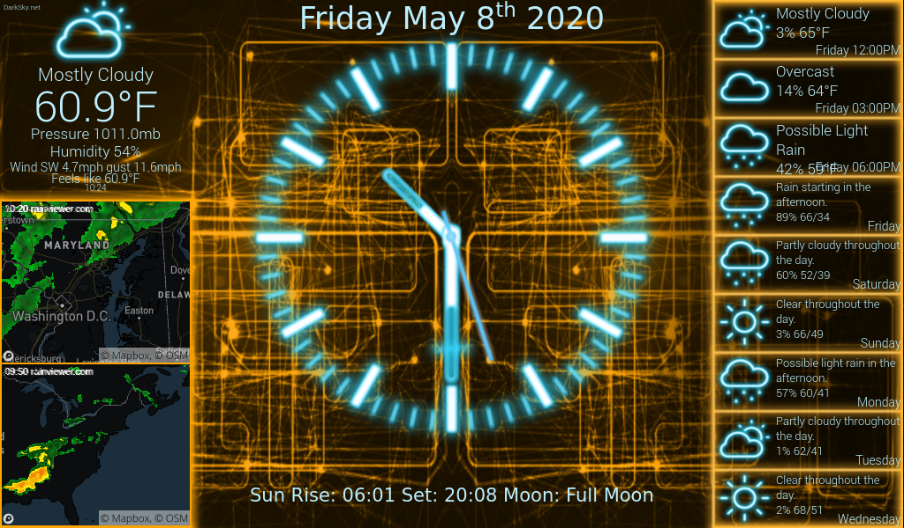
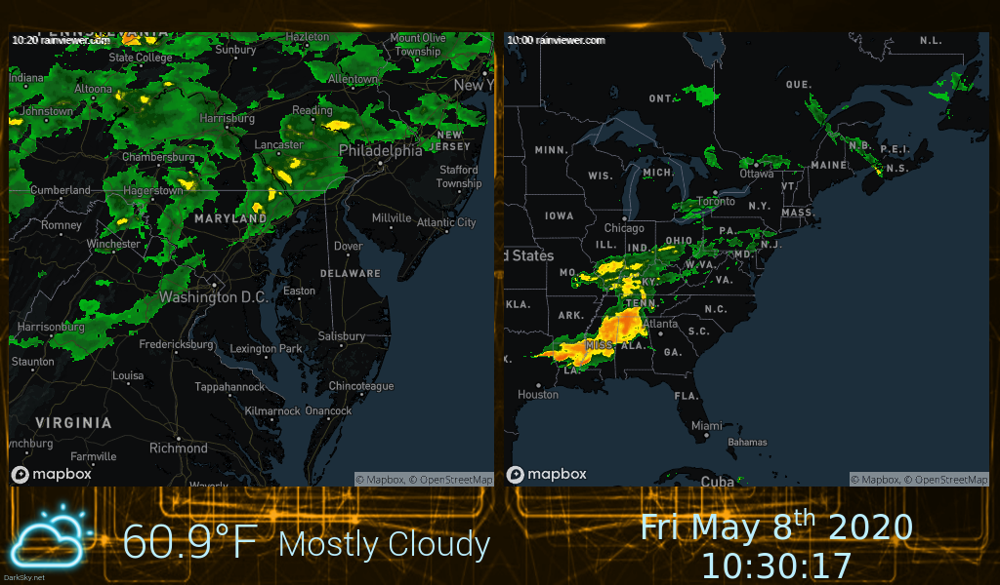

# PiClock
## PiClock Mods
Fork of [PiClock v1 by n0bel](https://github.com/n0bel/PiClock) that uses custom dark maps from MapBox, 
for better contrast between the weather radar and the maps, with an additional map overlay so that 
rain/snow clouds do not obscure map information, such as labels, boundaries, and roads.

The radar windows consist of three layers:
 - Bottom layer is a plain MapBox dark map with no labels, boundaries, or roads.
 - Middle layer is the weather radar imagery.
 - Top layer is a transparent MapBox map with only labels, boundaries, and roads.

This fork was rewritten in Python 3 and PyQt5, so it will run on Raspberry Pi OS version Bullseye or later
(Bookworm, Trixie...)

**A newer version, [PiClock3 by n0bel](https://github.com/n0bel/PiClock3), is now available, which is more modular 
and can be customized with your own plugins.**

## Screenshots of PiClock with Dark Maps

A lot of the weather and radar services this was built on have come and gone, or been restricted. 
Radar now comes from [LibreWXR](https://librewxr.net/), 
while [RainViewer](https://www.rainviewer.com/) is still selectable in your `Config.py` via the `userainviewer` setting.

The current weather conditions and forecasts come from METAR and/or [Open-Meteo](https://open-meteo.com/) 
so no weather signup is needed, unless you put an API key in your `ApiKeys.py` for 
[OpenWeatherMap](https://openweathermap.org/price) or
[Tomorrow.io](https://www.tomorrow.io/weather-api/). Both are virtually free.

An API key is still required for either [MapBox](https://account.mapbox.com/auth/signup/) or 
[Google Maps](https://developers.google.com/maps/documentation/maps-static/overview) 
in your `ApiKeys.py` for the maps under/over the radar. Both are virtually free.

## Gettings Started

If you want to build your own, I'd suggest starting with the overview:
[Overview of the PiClock](Documentation/Overview.md)

To install the PiClock on your Raspberry Pi, follow these instructions (all the extra hardware 
(IR Remote, GPIO buttons, Temperature, LEDs) is optional):
[Install Instructions for PiClock](Documentation/Install.md)

If you want to use the PiClock on a different desktop (not your Raspberry Pi), I'd suggest using these instructions:
[Install Instructions for PiClock (Clock Only)](Documentation/Install-Clock-Only.md)

Of course, you can jump to the hardware guide anytime:
[PiClock Hardware Guide](Documentation/Hardware.md)

## Original [PiClock v1](https://github.com/n0bel/PiClock) description by [n0bel](https://github.com/n0bel/)
A Fancy Clock built around a monitor and a Raspberry Pi

This project started out as a way to waste a Saturday afternoon.
I had a Raspberry Pi and an extra monitor and had just taken down an analog clock from my living room wall.
I was contemplating getting a radio sync'ed analog clock to replace it, so I didn't have to worry about
it being accurate.

But instead, the PiClock was born.

The early days and evolution of it are chronicled on my blog:
[NØBEL Blog - Raspberry Pi Clock](http://n0bel.net/v1/index.php/projects/raspberry-pi-clock)
